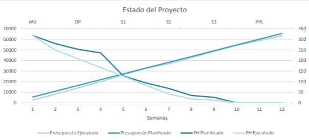
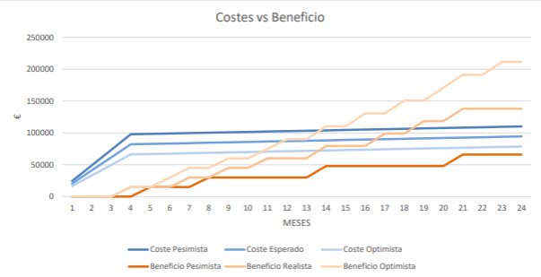

# Análisis de Costes

****
| NOMBRE DEL PROYECTO | CLIENTE  | EQUIPO DE TRABAJO | FECHA DE ELABORACIÓN | FASE DEL PROYECTO |
|---------------------|----------|-------------------|----------------------|-------------------|
| Cocemfe-Web         | COCEMFE  | Grupo 10          | 22/04/2024           | Sprint3           |

| MIEMBROS DEL EQUIPO DE TRABAJO | MIEMBROS DEL EQUIPO DE TRABAJO |
|--------------------------------|--------------------------------|
| Ignacio Arroyo Mantero         | Eloy Jiménez Medina            |
| Tadeo Cabrera Gómez            | Daniel Cortés Fonseca          |
| Andrés Jesús Somoza Sierra     | Fernando Baquero Fernández     |
| Pablo Pino Mateo               | Guillermo Gómez Romero         |
| Antonio Maqueda Acal           | Jesús Solís Ortega             |
| Gonzalo Ribas Luna             | Jaime García García            |
| Antonio Peláez Moreno          | Lucas Antoñanzas del Villar    |
| Álvaro Vázquez Conejo          | Raúl Hernán Mérida Bascón      |
| Ignacio González González      |                                |

****

| **NIVEL DE EXACTITUD**  | **UNIDADES DE MEDIDA**  | **UMBRALES DE CONTROL**                                                                                                                                                                                                        |
|-------------------------|---|--------------------------------------------------------------------------------------------------------------------------------------------------------------------------------------------------------------------------------|
| Moneda: dos decimales   Tiempo: un decimal  | Moneda: euro   Tiempo: horas  | 
Las horas de dedicación no pueden exceder en más de un  5% la planificación inicial.   

Los costes de mantenimiento están sujetos a las tarifas de las herramientas y las necesidades específicas del proyecto.  
 |

****

## ÁMBITO DE APLICACIÓN Y CONTEXTO
La estimación de costes se hará en base al salario estimado y promedio de los puestos Junior de los distintos perfiles profesionales involucrados en el desarrollo de software.
Somos 17 alumnos del Grado de ingeniería del software en la asignatura de Ingeniería del Software y Práctica Profesional (ISPP), por lo que el salario del personal durante el presente desarrollo, en tanto tiempo imputado en concepto de práctica de dicha asignatura, se establece solo a título informativo y como práctica, no debiendo ser abonado por el cliente.
El coste de mantenimiento, por otra parte, es una estimación del coste que supondría a la organización seguir usando el 
producto una vez acabado el desarrollo y la asignatura. Dicho coste correrá a cargo de la organización siendo estos los 
responsables de contratar dado el caso, los servicios o personal oportunos.

## ANÁLISIS DE COSTES
### Propósito del análisis de costes
El análisis de costos es una práctica fundamental en la gestión empresarial que implica examinar y evaluar detalladamente todos los gastos asociados con la producción, operación y mantenimiento de un producto o servicio. Esta actividad proporciona información crucial para la toma de decisiones estratégicas y tácticas en un proyecto.

### Desarrollo de los costes
#### Costes de contratación de personal
| Puesto/Roles                 | Tiempo de Trabajo | Sueldo | Precio Mensual[1] |Precio Mensual (Con costes sociales )| Precio Mensual Ponderado | Precio Total |
|------------------------------|-------------------|--------|--------------------|--------------------------|--------------|
| Ingeniero de software Junior | 150 horas         | 20 €/h | 5,600 €/mes        |30.95€*10 horas *4.2 semanas| 840 €/mes               | 1,300 €      |
| GPRD Officer           | 150 horas       | 20 €/h| 5,600 €/mes  |30.95€*10 horas *4.2 semanas     | 840 €/mes             | 1,300 €      |
| Comunity mánager           | 150 horas       | 20 €/h| 5,600 €/mes    |30.95€*10 horas *4.2 semanas   | 840 €/mes             | 1,300 €      |
| Total x17 personas           | 2,55*0 horas       | 340 €/h| 95,200 €/mes    |22100€   | 14,280 €/mes             | 51,000€      |

#### Recursos materiales[1] [2]
| Concepto              | Precio      | Precio ponderado |
|-----------------------|-------------|------------------|
| Amortización del material | 495,83 €/mes | 74.38 €/mes |
| Electricidad + agua   | 700 €/mes  | 105 €/mes        |
| Oficina               | 2700 €/mes | 405 €/mes        |
| Totales               | 3895.83 €/mes | 584.38 €/mes   |

#### Costes de software de desarrollo[3]
| Concepto        | Precio      |
|-----------------|-------------|
| GitHub Team     | 68 €/mes    |
| OneDrive for Business | 198.9 €/mes |
| Total           | 266.9 €/mes |

#### Costes de mantenimiento[4]
| Concepto              | Precio       |
|-----------------------|--------------|
| Coste de personal     | 0.10 €/mes   |
| Google Cloud Platform | 33.18 €/mes |
| Total                 | 33.28 €/mes |

### Coste de operación (OPEX) estimado
| Concepto                | Precio mensual ponderado | Descripción |
|-------------------------|--------------------------|-------------|
|Costes de personal       | 37.706 €/mes             | Costo mensual promedio de 17 ingenieros de software junior|
|Electricidad + Agua      | 105 €/mes                |Gasto mensual en electricidad y agua para la oficina|
|Oficina                  | 405 €/mes                |Coste mensual de la amortización del espacio de oficina|
|Herramientas de Desarrollo|68 €/mes                 |Suscripción mensual a GitHub Team|
|Almacenamiento en la Nube| 198.9 €/mes              |Suscripción mensual a OneDrive for Business|
|Mantenimiento del Software| 33.28 €/mes             |Coste nensual del mantenimiento de Google Cloud Platform|

### Costes de capitalización (CAPEX)
| Concepto                | Precio mensual ponderado | Descripción |
|-------------------------|--------------------------|-------------|
|Amortización del material| 75.38 €/mes              | Costo ensual de la amortización del matterial utilizado por cada desarrollador, ordenadores, monitores, etc ...|

#### Estimación TCO estimado (OPEX) vs. TCO real (OPEX)
| Concepto                | Coste estimado (sin costes sociales) | Coste real (sin costes sociales) | Variación |
|-------------------------|----------------|------------|-----------|
| Costes de personal      | 12 semanas * 10 horas * 17 personas * 20 = 40800€ | 1696 horas * 20 = 39540€     | 1000€ - 96% del estimado de horas |
| Electricidad + Agua     | 12 semanas * 7 dias / 30 días mensuales * 105€ = 294€| 10 semanas * 7 días /30 días mensuales * 105€ =  245€       | 0€        |
| Oficina                 | 12 semanas * 7 dias / 30 días mensuales * 405€ =1135€           | 10 semanas * 7 dias / 30 días mensuales * 405€ = 1135€       | 0€        |
| Herramientas de Desarrollo | 12 semanas * 7 dias / 30 días mensuales * 68 € = 190€        | 10 semanas * 7 dias / 30 días mensuales * 68€ = 190€       | 0€        |
| Almacenamiento en la Nube   | 12 semanas * 7 dias / 30 días mensuales * 198.9€ = 557€        | 10 semanas * 7 dias / 30 días mensuales * 198.9€ = 557€       | 0€        |
| Mantenimiento del Software  | 12 semanas * 7 dias / 30 días mensuales * 33.28€ = 93€         | 10 semanas * 7 dias / 30 días mensuales * 33.28€ = 93€        | 0€        |
| Amortización del materal  | 12 semanas * 7 dias / 30 días mensuales * 74.38€ = 208€         | 10 semanas * 7 dias / 30 días mensuales * 74.38€ = 208€        | 0€        |

Las tablas anteriores muestran la estimación de costes hasta el momento desde el inicio del proyecto, separados en costes de tipo OPEX y CAPEX.

---

### Gráfica sobre estado del Proyecto hasta Sprint 2:

## ANÁLISIS DE BENEFICIOS
### Beneficios Directos:
1. **Ahorro de Tiempo y Recursos:** La aplicación agiliza el proceso de gestión de documentos, reduciendo el tiempo y los recursos necesarios para este fin.
2. **Eficiencia Mejorada:** Facilita la colaboración entre profesionales y el proceso de revisión de documentos, lo que mejora la eficiencia operativa.
3. **Transparencia Mejorada:** Permite un seguimiento transparente del estado de los documentos y de los comentarios de los profesionales, lo que mejora la comunicación y la coordinación.
### Beneficios Indirectos:
1. **Mejora de la Calidad:** La capacidad de colaboración y revisión de documentos puede mejorar la calidad de los mismos.
2. **Cumplimiento Normativo:** Ayuda a garantizar que los documentos cumplan con los estándares y regulaciones requeridos, reduciendo el riesgo de incumplimiento y sanciones.

## CÁLCULOS DEL PRECIO DE VENTA
Costo de Desarrollo: si tenemos en cuenta que el desarrollo de la aplicación es de 15 semanas, desglosando los tipos de coste por el tiempo de desarrollo:
1. **Costes de Contratación de Personal:**15 semanas * 10 horas * 17 personas * 30.95 €/hora = 79000€
  2. **Recursos de Materiales:** (584.38€ mes / 30 días) * (15 semanas * 7 días) = 2043€
  3. **Coste de Software de Desarrollo:** (266.9 € mes / 30 días) * (15 semanas * 7 días) = 934,5€
  4. **Coste de Mantenimiento:** (33.28€ mes / 30 días) * (15 semanas * 7 días) = 116,5€
- **Coste Total Real:** 82094€

Teniendo en cuenta que los desarrolladores tengan que dedicar un 20% más tiempo en el proyecto:
1.	**Costes de Contratación de Personal:** (15 semanas * 10 horas * 17 personas * 30.95 €/hora) + (15 semanas * 10 horas * 17 personas * 20 €/hora * 20 / 100) = 94707€
2.	**Recursos de Materiales:** (584.38€ mes / 30 días) * (15 semanas * 7 días) = 2043€
3.	**Coste de Software de Desarrollo:** (266.9 € mes / 30 días) * (15 semanas * 7 días) = 934,5€
4.	**Coste de Mantenimiento:** (33.28€ mes / 30 días) * (15 semanas * 7 días) = 116,5€
- **Coste Total Pesimista:** 97801€

Teniendo en cuenta que los desarrolladores tengan que dedicar un 20% menos tiempo en el proyecto:
1.	**Costes de Contratación de Personal:** (15 semanas * 10 horas * 17 personas * 30.95 €/hora) - (15 semanas * 10 horas * 17 personas * 30.95 €/hora * 20 / 100) = 63138€
2.	**Recursos de Materiales:** (584.38€ mes / 30 días) * (15 semanas * 7 días) = 2043€
3.	**Coste de Software de Desarrollo:** (266.9 € mes / 30 días) * (15 semanas * 7 días) = 934,5€
4.	**Coste de Mantenimiento:** (33.28€ mes / 30 días) * (15 semanas * 7 días) = 116,5€
- **Coste Total Optimista:** 66232€

## Estrategia de Precios para la Captación de Clientes
- **Precio Inicial Competitivo:** Estableceremos un precio inicial más bajo para hacer que tu aplicación sea más accesible y atractiva para una amplia gama de clientes potenciales.
- **Modelo de Ingresos Recurrentes:** Aunque el precio inicial será bajo, nos enfocaremos en generar ingresos recurrentes a través del mantenimiento continuo, actualizaciones y servicios adicionales ofrecidos a los clientes.
- **Incremento Gradual de Precios:** Conforme ganemos tracción en el mercado y demostremos el valor de nuestra aplicación, podremos aumentar gradualmente nuestros precios para reflejar el valor añadido que proporcionamos a nuestros clientes.

Precio de Venta: Considerando una estrategia agresiva de captación de clientes, podríamos establecer un precio inicial de alrededor de 15.000 euros.
Teniendo en cuenta que los Gastos anuales constan del: Coste de Mantenimiento y Coste de Recursos Materiales.

## Perspectiva Optimista

### Ingresos:
- **Ingresos del primer año:** 6 clientes * 15,000 euros = 90,000 euros.
- **Ingresos del segundo año:** (6 clientes * 15,000 euros) * (1.35 factor subida ya sea por precio del producto o por número de clientes) = 121,500 euros.
### Gastos:
- **Gastos anuales:** (33.28 euros + 584.38 euros) * 12 meses = 7,409.52 euros/año.
### Beneficios:
- **Beneficios del primer año:** Ingresos - Gastos = 90,000 euros - 7,409.52 euros = 82,590.48 euros.
- **Beneficios del segundo año:** Ingresos - Gastos = 121,500 euros - 7,409.52 euros = 114,090.48 euros.
- 8 meses para alcanzar los primeros beneficios según el coste realista.

## Perspectiva Realista

### Ingresos:
- **Ingresos del primer año:** 4 clientes * 15,000 euros = 60,000 euros.
- **Ingresos del segundo año:** (4 clientes * 15,000 euros) * (1.30 factor subida ya sea por precio del producto o por número de clientes) = 78,000 euros.
### Gastos:
- **Gastos anuales:** (33.28 euros + 584.38 euros) * 12 meses = 7,409.52 euros/año.
### Beneficios:
- **Beneficios del primer año:** Ingresos - Gastos = 60,000 euros - 7,409.52 euros = 52,590.48 euros.
- **Beneficios del segundo año:** Ingresos - Gastos = 78,000 euros - 7,409.52 euros = 70,590.48 euros.
- 13 meses para alcanzar los primeros beneficios según el coste realista. 
## Perspectiva Pesimista:
### Ingresos:
- **Ingresos del primer año:** 2 clientes * 15,000 euros = 30,000 euros.
- **Ingresos del segundo año:** (2 clientes * 15,000 euros) * (1.20 factor subida ya sea por precio del producto o por número de clientes) = 36,000 euros.
### Gastos:
- **Gastos anuales:** (33.28 euros + 584.38 euros) * 12 meses = 7,409.52 euros/año.
### Beneficios:
- **Beneficios del primer año:** Ingresos - Gastos = 30,000 euros - 7,409.52 euros = 22,590.48 euros.
- **Beneficios del segundo año:** Ingresos - Gastos = 36,000 euros - 7,409.52 euros = 28,590.48 euros.
- 25 meses para alcanzar los primeros beneficios según el coste realista.

## Total y resúmenes de costes
- **Coste mensual de operación:** 14,280 + 584.38 + 266.9 + 33.28 = 15,164.56 €
- **Coste total de operación:** 3.57 * (584.38 + 266.9 + 33.28) + 51,000 = 54,157.79 €
- **Coste de mantenimiento:** 33.28 €

## Referencias y justificación
1.	Estimamos el mes promedio en 4.2 semanas. Consecuentemente durante las 15 semanas de asignatura consideramos para estimar los costes un total de meses de 3.57 meses aprox.
2.	https://www.idealista.com/inmueble/103842580/ → hemos extrapolado el coste de una oficina para 17 personas y lo hemos ponderado con las horas dedicadas comparada con una jornada laboral estándar (~40h/semana). Por tanto, se multiplica por 6/40 = 0.15; de este modo 2700 * 0.15 = 405, se ha procedido del mismo modo para el resto de los cálculos de costes fijos mensuales.
3.	Costes software únicamente durante el desarrollo del proyecto.
4.	Costes mensuales de mantenimiento del proyecto, estarán presente durante el desarrollo y a lo largo de la vida útil del producto. MongoDB tiene un coste de 0.10€ por millón de lectura, en este informe se presupone que la aplicación consume un millón de lecturas al mes. El coste se ha obtenido del documento “technology management”.
